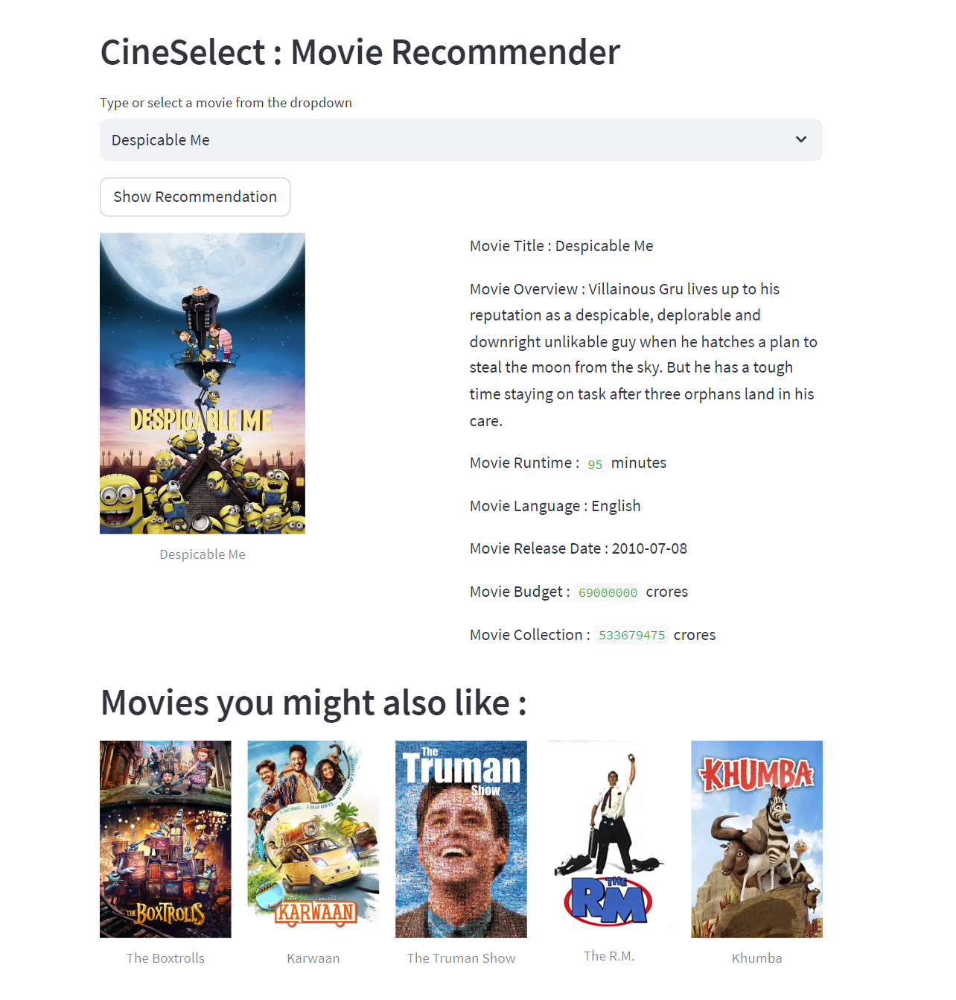

# Content Based Movie Recommender Using Machine Learning

This project features a content-based movie recommendation system leveraging data from TMDB (The Movie Database). The system, deployed with Streamlit, provides users with tailored recommendations for their top 5 movie picks.


## Features

  1) Content-Based Filtering
  2) TMDB Data Integration
  3) Streamlit Deployment
## Installation

clone the repository

```bash
https://github.com/LokeshYadav-01/Movie-Recommender.git
```

Set up a virtual environment (optional but recommended):

```bash
python -m venv venv_name
source venv_name/bin/activate #For Linux or macOS users
venv_name\Scripts\activate #For Windows users
```

Install the necessary packages to run this project from requirements.txt

```bash
pip install -r requirements.txt
```

To run the app, open the app.ipynb cell and run 

```bash
!streamlit run app.py
```

## Usage

Open the streamlit application 

Search for a movie in the given list and click on the enter button, it will show the movie details and also it shows Similar Top 5 movies recommended on your given search movie

Here is a sample look of how the app looks like 



## Decoding the Movie Recommender: A Technical Walkthrough

1. Data Collection and Integration: Obtained the TMDB 5000 Movie Dataset, integrating diverse Indian movies from various languages into the dataset.

2. Feature Extraction: Selected critical features including 'movie_id', 'title', 'overview', 'genres', 'keywords', 'cast', 'crew', and 'original language'.

3. Tag Generation: Created a new 'tags' column by extracting relevant keywords from the gathered features.

4. Text Vectorization: Employed a bag-of-words approach to form a tags vector. This involved identifying the Top 5000 frequent words after removing common stop words.

5. Sparse Matrix Representation: Utilized CountVectorizer from the Scikit-learn library to transform the tags into a sparse matrix, highlighting the most frequent words.

6. Stemming for Redundancy Reduction: Applied stemming using the Natural Language Toolkit (NLTK) to eliminate redundant forms of similar words.

7. Vector Building: Constructed a vector using the top 5000 words, creating a comprehensive representation of the movie data.

8. Similarity Assessment: Utilized cosine_similarity to gauge the similarity between movies based on their respective vectors.

9. Deployment with Streamlit: Implemented a user-friendly interface using Streamlit, allowing users to seamlessly interact with the recommendation system.

10. TMDB API Integration: Leveraged the TMDB API with an assigned API key to access movie posters and additional details, enhancing the user experience.
